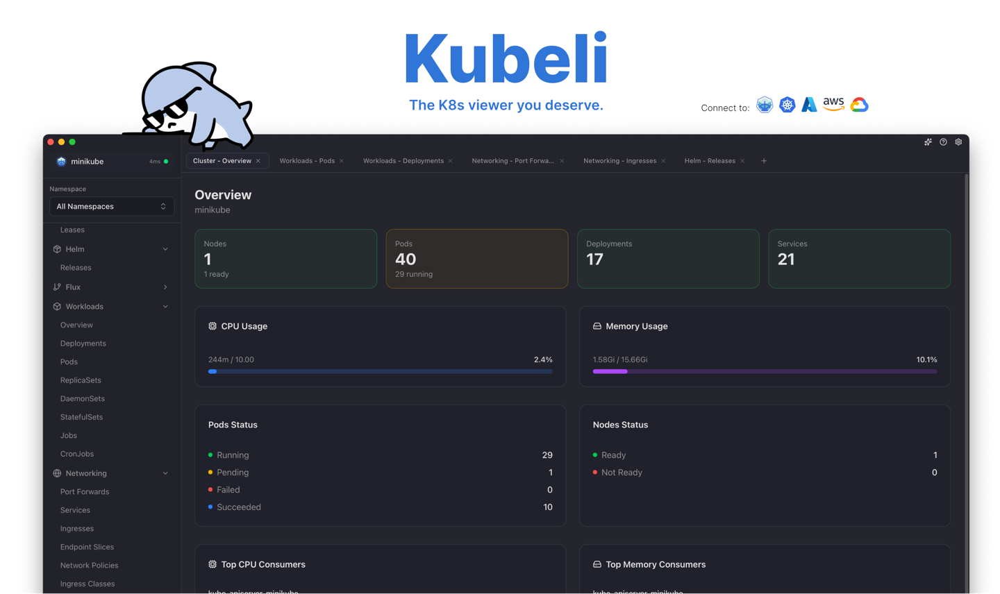

<p align="center">
  
</p>

<p align="center">
  <a href="https://github.com/atilladeniz/Kubeli/actions/workflows/ci.yml"></a>
  <a href="https://github.com/atilladeniz/Kubeli/releases/latest"></a>
  <a href="https://github.com/atilladeniz/Kubeli/blob/main/LICENSE"></a>
  <a href="https://cyclonedx.org/"></a>
  
  <a href="https://github.com/atilladeniz/Kubeli/releases"></a>
</p>

# Kubeli

A modern, beautiful Kubernetes management desktop application with real-time monitoring, terminal access, and a polished user experience.

## Features

- **Multi-Cluster Support** - Connect to multiple clusters, auto-detect provider type (Minikube, EKS, GKE, AKS)
- **Real-Time Updates** - WebSocket-based pod watching with efficient Kubernetes watch API
- **Resource Browser** - View and manage Pods, Deployments, Services, ConfigMaps, Secrets, Nodes, and more
- **Pod Logs** - Stream logs in real-time with filtering, search, and export
- **Terminal Access** - Interactive shell access to running containers via XTerm.js
- **Port Forwarding** - Forward ports from pods/services to localhost with status tracking
- **Metrics Dashboard** - CPU and memory usage visualization (requires metrics-server)
- **YAML Editor** - Full Monaco editor integration for viewing and editing resources
- **AI Assistant** - Integrated AI support with Claude Code CLI and OpenAI Codex CLI
- **MCP Server** - Model Context Protocol server for IDE integration (VS Code, Cursor, Claude Code)
- **Helm Releases** - View and manage Helm deployments
- **Proxy Support** - HTTP/HTTPS/SOCKS5 proxy configuration for corporate environments
- **Internationalization** - English and German language support
- **Dark/Light Mode** - Theme support with vibrancy effects

## Tech Stack

| Layer | Technology |
|-------|------------|
| Frontend | Next.js 16, React 19, TypeScript, Tailwind CSS 4 |
| Desktop | Tauri 2.0 (Rust) |
| K8s Client | kube-rs with k8s-openapi v1.32 |
| State | Zustand |
| UI Components | Radix UI, Lucide Icons |
| Editor | Monaco Editor |
| Terminal | XTerm.js |
| Charts | Recharts |

## Installation

### Download

Download the latest release for your platform from the [Releases](https://github.com/atilladeniz/kubeli/releases) page.

### Build from Source

**Prerequisites:**
- Node.js 18+
- Rust 1.70+
- pnpm (recommended) or npm

```bash
# Clone the repository
git clone https://github.com/atilladeniz/kubeli.git
cd kubeli

# Install dependencies
make install

# Run in development mode
make dev

# Build for production
make build
```

## Development

```bash
# Start Tauri + Next.js dev environment
make dev

# Start Next.js only (no Tauri)
make web-dev

# Run linting
make lint

# Format code
make format

# Type check
make check
```

## Testing

```bash
# Frontend unit tests
npm run test

# Backend unit tests
cd src-tauri && cargo test

# E2E smoke tests (static export + mocked IPC)
npm run test:e2e
```

## Local Testing Lab

For testing Kubeli with simulated environments (OpenShift, EKS/GKE/AKS contexts, auth errors, scale testing), see the [Local Testing Lab documentation](.dev/README.md). This allows you to test environment detection and error handling without cloud provider access.

```bash
# Quick examples
make minikube-setup-openshift    # OpenShift CRDs + Routes
make kubeconfig-fake-eks         # Fake EKS context
make minikube-setup-scale N=100  # Create 100 dummy pods
```

## SBOM (Software Bill of Materials)

Kubeli provides [CycloneDX](https://cyclonedx.org/) SBOMs for supply chain security and compliance.

### What's Included

| SBOM File | Contents | Format |
|-----------|----------|--------|
| `sbom-npm.json` | Production npm dependencies | CycloneDX 1.5 JSON |
| `sbom-rust.json` | Production Rust crates | CycloneDX 1.5 JSON |

### Automatic Generation

Every [GitHub Release](https://github.com/atilladeniz/Kubeli/releases) includes validated SBOMs as downloadable assets. The CI pipeline:

1. Generates SBOMs excluding dev/build dependencies
2. Validates against CycloneDX 1.5 schema
3. Attaches to release for audit/compliance download

### Local Generation

```bash
# Generate both SBOMs
make sbom

# Generate and validate (requires Docker)
make sbom-validate
```

### Enterprise Use

These SBOMs support:
- **Vulnerability scanning** (Grype, Trivy, Snyk)
- **License compliance** audits
- **Supply chain security** (SLSA, SSDF frameworks)
- **Regulatory requirements** (FDA, EU CRA, Executive Order 14028)

## Security Scanning

Kubeli includes automated security scanning in CI and local development.

### Automated Scans (CI)

| Scanner | Purpose | Trigger |
|---------|---------|---------|
| **Trivy** | SBOM vulnerability scanning | PRs, pushes to main |
| **Trivy** | Secret & misconfiguration detection | PRs, pushes to main |
| **Semgrep** | Static code analysis (SAST) | PRs, pushes to main |

Results appear in the GitHub Security tab (requires GitHub Advanced Security for private repos).

### Local Scanning

```bash
# Run all security scans (requires Docker)
make security-scan

# Individual scans
make security-trivy    # Vulnerability + secret scanning
make security-semgrep  # Static code analysis
```

### Configuration

- `trivy.yaml` - Severity thresholds and scan settings
- `trivy-secret.yaml` - Secret detection rules
- `.semgrep.yaml` - Custom SAST rules for TypeScript and Rust

## Supported Kubernetes Providers

| Provider | Detection | Icon |
|----------|-----------|------|
| Minikube | Context name | Yes |
| AWS EKS | Context/URL pattern | Yes |
| Google GKE | Context/URL pattern | Yes |
| Azure AKS | Context/URL pattern | Yes |
| Generic K8s | Fallback | Yes |

## Project Structure

```
kubeli/
├── src/                    # Next.js frontend
│   ├── app/                # App Router pages
│   ├── components/         # React components
│   │   ├── features/       # Dashboard, Resources, Logs, Terminal
│   │   ├── layout/         # Sidebar, Titlebar
│   │   └── ui/             # Radix UI components
│   └── lib/
│       ├── hooks/          # useK8sResources, useLogs, useShell, etc.
│       ├── stores/         # Zustand stores
│       ├── tauri/          # Tauri command bindings
│       └── types/          # TypeScript definitions
├── src-tauri/              # Tauri/Rust backend
│   └── src/
│       ├── commands/       # clusters, resources, logs, shell, portforward
│       └── k8s/            # KubeClientManager, config parsing
└── Makefile                # Development shortcuts
```

## Changelog

See [CHANGELOG.md](CHANGELOG.md) for a detailed list of changes.

## License

This project is licensed under the MIT License - see the [LICENSE](LICENSE) file for details.

## Author

Created by [Atilla Deniz](https://atilladeniz.com)
